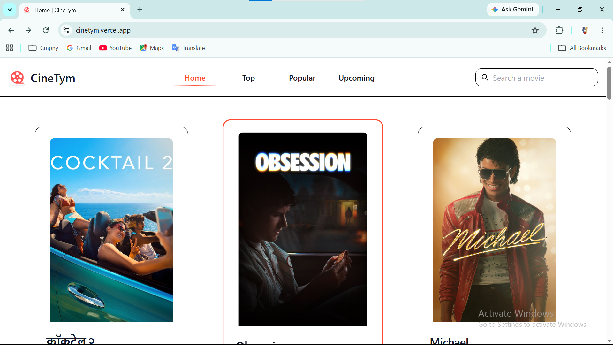
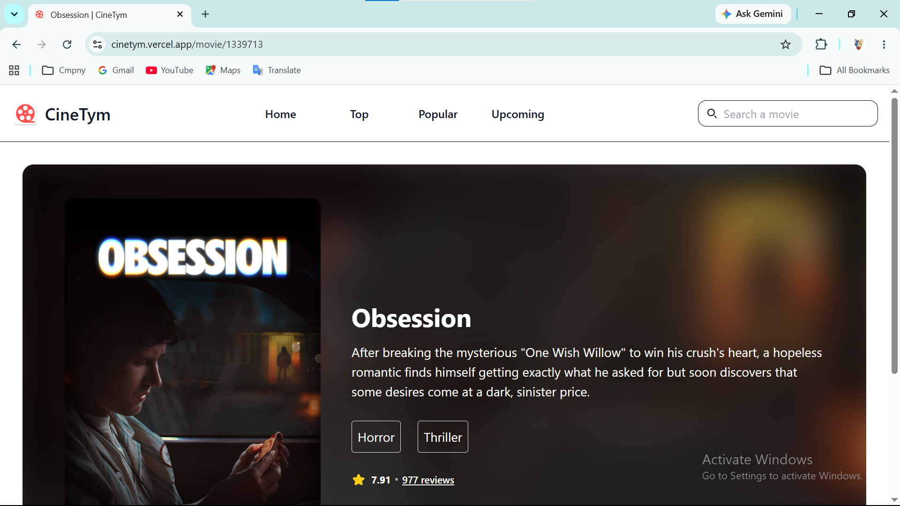
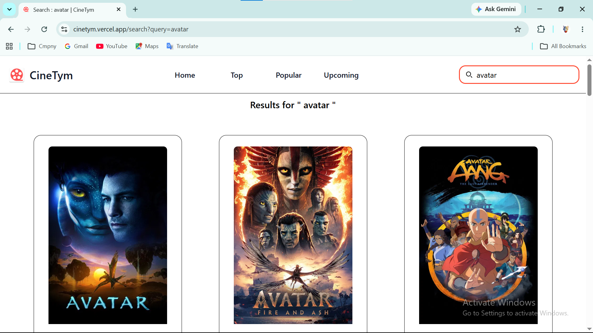

# 🎬 Cinetym

Cinetym is a modern movie discovery web application that allows users to explore trending, popular, top-rated, and upcoming movies. Built with React and TMDB API, the platform provides an intuitive and responsive experience for discovering movie details, ratings, release dates, and trailers.

## 🚀 Live Demo

🔗 https://cinetym.vercel.app

---

## 📸 Screenshots

### Home Page


### Movie Details


### Search Movies


---

## ✨ Features

### 🎥 Movie Discovery
- Browse Trending Movies
- Explore Popular Movies
- View Top Rated Movies
- Discover Upcoming Releases

### 🔍 Smart Search
- Search movies instantly
- Real-time movie results
- Quick access to movie information

### 📄 Detailed Information
- Movie overview and synopsis
- Ratings and vote counts
- Genres
- Movie posters and backdrops

### 📱 Responsive Design
- Mobile-friendly interface
- Tablet optimized layouts
- Desktop responsive experience

### ⚡ Performance
- Fast API fetching
- Smooth navigation
- Optimized user experience

---

## 🛠️ Tech Stack

### Frontend
- React.js
- Vite
- Tailwind CSS
- React Router DOM

### API
- TMDB (The Movie Database) API

### Deployment
- Vercel

---

## 📂 Folder Structure

```bash
Cinetym/
│
├── public/
│
├── src/
│   ├── assets/
│   ├── components/
│   ├── pages/
│   ├── services/
│   ├── App.jsx
│   └── main.jsx
│
├── screenshots/
│   ├── home.png
│   ├── details.png
│   └── search.png
│
├── .env
├── package.json
├── vite.config.js
└── README.md
```

---

## ⚙️ Getting Started

### Prerequisites

Make sure you have installed:

- Node.js (v18 or later)
- npm

Check versions:

```bash
node -v
npm -v
```

---

## 🔧 Installation

### 1. Clone the Repository

```bash
git clone https://github.com/vinothkumarS1710/CineTym.git
```

### 2. Navigate to Project Directory

```bash
cd cinetym
```

### 3. Install Dependencies

```bash
npm install
```

---

## ▶️ Run Locally

Start the development server:

```bash
npm run dev
```

Application will run at:

```bash
http://localhost:5173
```

---

## 🏗️ Build for Production

```bash
npm run build
```

Preview production build:

```bash
npm run preview
```

---

## 🌟 Key Highlights

- Modern React Architecture
- Component-Based Design
- Responsive User Interface
- API Integration with TMDB
- Fast Search Functionality
- Dynamic Routing
- Optimized Performance

---


## 🤝 Contributing

Contributions are welcome!

### Steps

1. Fork the repository

2. Create your feature branch

```bash
git checkout -b feature/new-feature
```

3. Commit your changes

```bash
git commit -m "Add new feature"
```

4. Push to GitHub

```bash
git push origin feature/new-feature
```

5. Open a Pull Request

---

## 🐛 Issues

If you find any bugs or want to request a feature, feel free to open an issue.

---

## 👨‍💻 Author

### Vinoth Kumar S

- Email:  vinothkumarbscit46@gmail.com
- LinkedIn: https://www.linkedin.com/in/vinoth-fullstack

---

## 🙌 Acknowledgements

- TMDB API for movie data
- React Community
- Tailwind CSS
- Vite

---

⭐ If you found this project useful, don't forget to give it a star on GitHub!